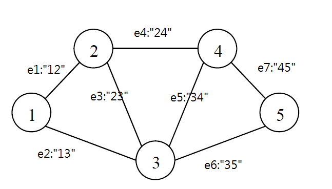

# BDD 各式路徑信賴度計算

提供給有向/無向圖 計算可靠度用，  
**輸出由第 1 節點 連接到 最後一個節點的所有路徑與對應的可靠度**

## 邊的順序



由 NODE-NODE 表示，如 1, 2 節點中有一邊，則其表示為 12 邊
所有邊 由此表示法排列，如圖例為(e12, e13, e23, e24, e34, e35, e45)

## 輸入檔案的格式

```
5
0 1 1 0 0
1 0 1 1 0
1 1 0 1 1
0 1 1 0 1
0 0 1 1 0
0.8 0.8 0.8 0.8 0.8 0.8 0.8
```

第 1 行： 總節點數(NODES)

第 2 ~ NODES + 1 行：相鄰矩陣(NODES \* NODES 的 matrix)

第 NODES + 2 行： 各邊的運作機率，依造邊的順序輸入  
無論單向雙向邊皆僅需輸入一次，如上圖皆為雙向邊，**各邊僅需輸入一次即可**(e12 = e21)

## 使用方式

```
> g++ -o BDD BDD.cpp
> BDD.exe graph2.txt
```

編譯成執行檔後，呼叫執行檔，並傳遞輸入檔案位置作為參數

## 輸出格式

```
Total cost 0.333 seconds

SOLS_PATH: 59
State   Reliability
----------------------
0100010     0.0002048
0100011     0.0008192
0101010     0.0008192
0101011     0.0032768
0100101     0.0008192
0101101     0.0032768
0100110     0.0008192
0100111     0.0032768
```

1. 顯示 計算所需時間(僅計算)
2. 顯示 可用解數量
3. 繪製 (State, Reliability) 表格，State 0 代表 未連接，1 代表連接  
   如 (0100010, 0.002048)： (e13, e35 邊連線，運作可靠度為 0.2048%)
